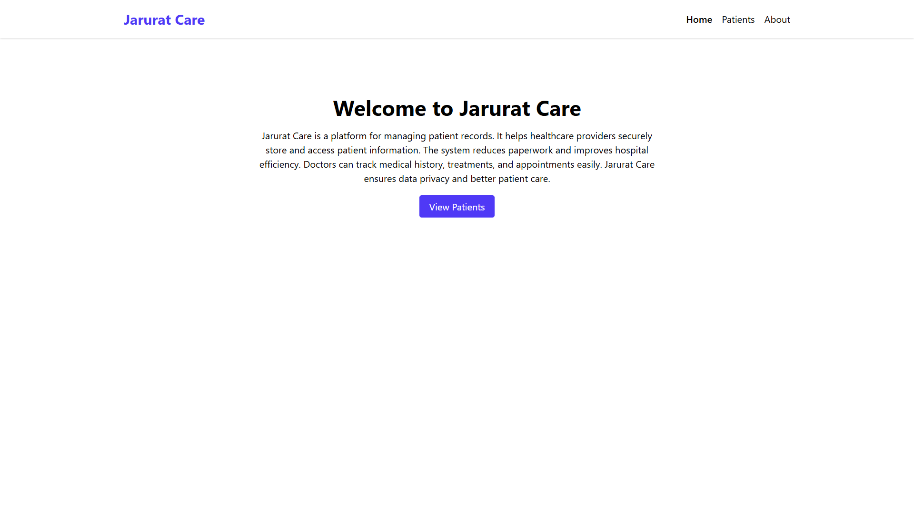

# Patient Records Dashboard

A simple full-stack project using Vite + React + Tailwind for the frontend and Express (Node) for the backend API.
This project uses a mock JSON file for patient data (no external database required), meeting the MERN-style pattern while keeping setup simple.

## Features
- Landing page with navigation (Jarurat Care)
- Patients page: fetches patient list from `/api/patients`
- Responsive card/grid layout showing Name, Age, Contact
- Search bar to filter patients by name
- View Details modal for each patient
- Add New Patient (local, updates client state)
- Loading & error states

## Setup

### Server
1. `cd server`
2. `npm install`
3. `npm run start` — starts server at `http://localhost:4000`
   - API endpoints:
     - `GET /api/patients` — list
     - `GET /api/patients/:id` — details
     - `POST /api/patients` — add (writes to JSON file)

### Client
1. `cd client`
2. `npm install`
3. `npm run dev` — starts Vite dev server at `http://localhost:5173` (default)

To run both concurrently, open two terminals and run server and client separately.

## Screenshots

### 🏠 Home Page

### 👩‍⚕️ Patients Dashboard

### ℹ️ About Page

## Notes
- This uses a local JSON file (`server/data/patients.json`) to store patient data so there's no external DB required.
- To adapt to a real MongoDB, replace server data layer with Mongoose models and connect to your MongoDB URI.

